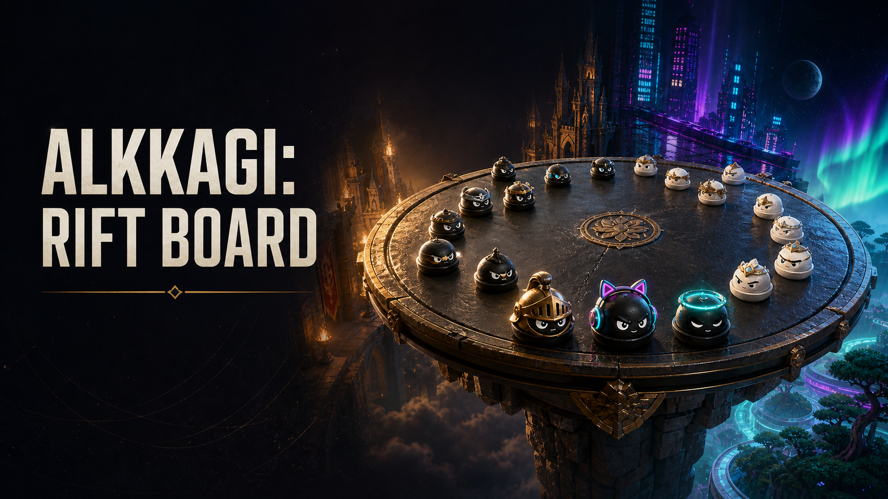

# ALKKAGI: RIFT BOARD

한국의 전통 놀이 알까기를 프리미엄 3D 턴제 아레나 게임으로 재해석한 HTML5 웹 게임입니다. 캐릭터 돌을 뒤로 당겨 힘과 회전을 조절하고, 상대 돌을 위험한 아레나 아래로 떨어뜨리면 보너스 턴을 얻습니다.

## [지금 웹에서 플레이하기](https://alkkagi-rift-board.isaacweb007.chatgpt.site/arena)

## [GitHub Pages에서 바로 플레이하기](https://isaacweb007.github.io/alkkagi-rift-board/)



## 현재 구현된 기능

- WebGL/Three.js 기반 3D 알까기 물리 엔진
- 3 대 3 속전과 5 대 5 정규전
- 20초 자유 배치와 랜덤 선공
- 상대 돌 링아웃 시 보너스 샷
- 힘 조절, 좌·우 회전, 곡선 궤적 및 첫 충돌 예측
- 고유 능력치 5종과 캐릭터 스킬 10종
- 난이도 조절이 가능한 지옥 AI 연습전
- 흑돌·백돌 진영 무작위 배정
- 360도 카메라 회전과 줌
- 속성 충돌 효과, 링아웃 연출, 전투 기록과 사운드 믹서
- 경기 리플레이와 로컬/서버 프로필 진행도
- 한국어를 포함한 7개 언어 콘셉트 북

## 기술 구성

- Next.js 16 / React 19
- Three.js
- vinext / Cloudflare Workers
- Cloudflare D1 / Drizzle ORM
- TypeScript

## 로컬 실행

Node.js `22.13.0` 이상이 필요합니다.

```bash
npm install
npm run dev
```

브라우저에서 `http://localhost:3000/arena`를 엽니다.

## 검증

```bash
npm run lint
npm test
```

`npm test`는 프로덕션 빌드, 서버 렌더링, 물리 시뮬레이션, 링아웃 규칙, 턴 판정, 곡선 조준, 리플레이 검증을 실행합니다.

## 주요 문서

- [전체 게임 제작 문서 인덱스](docs/README.md)
- [게임 완성 로드맵](GAME_COMPLETION_ROADMAP.md)
- [골든 아트 디렉션](GOLDEN_ART_DIRECTION.md)
- [7개 언어 비주얼 콘셉트 북](public/ALKAGI_CONCEPT_BOOK.html)
- [구현용 오디오 이벤트 명세](specs/audio-events.csv)

## 프로젝트 전용 제작 스킬

- [`design-alkkagi-game`](skills/design-alkkagi-game/SKILL.md): 물리 규칙, 세계관, 캐릭터, 모드와 밸런스를 일관되게 설계합니다.
- [`direct-game-feel-audio`](skills/direct-game-feel-audio/SKILL.md): 충돌음, 음악, VFX, 카메라, 히트스톱과 접근성을 하나의 타격감 시스템으로 설계합니다.

## 현재 개발 단계

플레이 가능한 3D 연습전 수직 슬라이스가 배포되어 있습니다. 다음 핵심 단계는 서버 권위형 실시간 대전, 랭크 매칭 세션, GLTF 캐릭터 리깅·표정 애니메이션, 상점·업그레이드 및 지갑 정산 시스템입니다.
